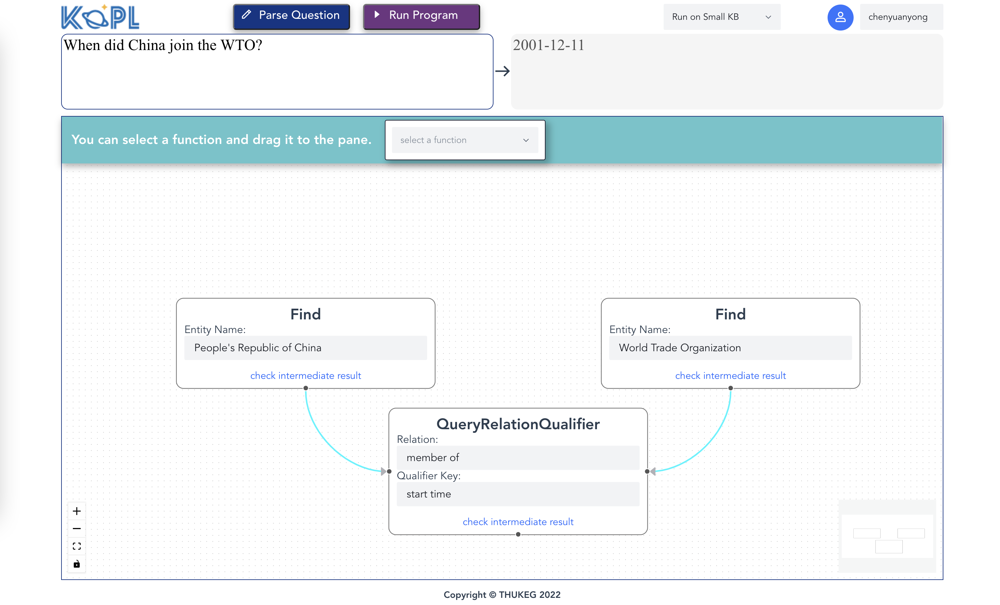

# KoPL-vis

This is a webpage for visualization of KOPL-Engine, a system designed to execute programs which are written in KoPL, a kind of kwonledge oriented programming language for complex question answering.

The webpage is based on Vue.js.

## Installation
To install Node Json version below on linux, refer [LINK](https://nodejs.org/en/download/package-manager):
```
Version `v18.20.4 (LTS)`, using nvm
```

Then, 
```
cd vis/
npm install
```

## Demo

